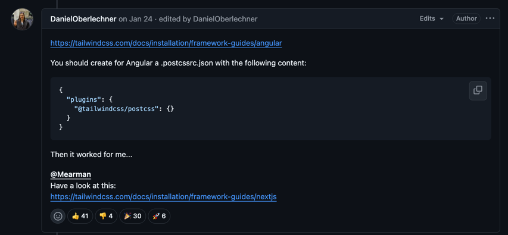

strapi:
ENDPOINTS:
API: http://localhost:1337/api/aboutme
CMS: http://localhost:1337/admin


## PROBLEM SOLVING
https://tailwindcss.com/docs/installation/using-vite#using-tailwind-via-cdn
check to do smth with errors with tailwind css(needs to decrease the version of vite to 5.4 - 6 versions) arxmt

## POSTCSS PROBLEM FIX


## Structure of Vue Project

src/
├── App.vue                 # Корневой компонент
├── views/
│   ├── HomeView.vue        # Главная страница
│   ├── AboutView.vue       # Страница "О нас"
│   └── ProductsView.vue    # Страница товаров
└── components/
├── AppHeader.vue           # Шапка сайта
├── ProductCard.vue         # Карточка товара
└── BaseButton.vue          # Кнопка
---
Когда создавать компонент?

    Если элемент повторяется >1 раза
    
    Если логику можно изолировать (например, модальное окно)
    
    Пример: ProductCard.vue, DropdownMenu.vue
---
Когда создавать view?

    Для каждой уникальной страницы (роута)
    
    Пример: UserProfileView.vue для /profile
---
App.vue лучше держать "чистым":

    Только общий layout
    
    Глобальные обработчики ошибок
    
    Основные провайдеры (например, для i18n)


## Recommended IDE Setup

[VSCode](https://code.visualstudio.com/) + [Volar](https://marketplace.visualstudio.com/items?itemName=Vue.volar) (and disable Vetur).

## Type Support for `.vue` Imports in TS

TypeScript cannot handle type information for `.vue` imports by default, so we replace the `tsc` CLI with `vue-tsc` for type checking. In editors, we need [Volar](https://marketplace.visualstudio.com/items?itemName=Vue.volar) to make the TypeScript language service aware of `.vue` types.

## Customize configuration

See [Vite Configuration Reference](https://vite.dev/config/).

## Project Setup

```sh
npm install
```

### Compile and Hot-Reload for Development

```sh
npm run dev
```

### Type-Check, Compile and Minify for Production

```sh
npm run build
```

### Run Unit Tests with [Vitest](https://vitest.dev/)

```sh
npm run test:unit
```

### Lint with [ESLint](https://eslint.org/)

```sh
npm run lint
```
